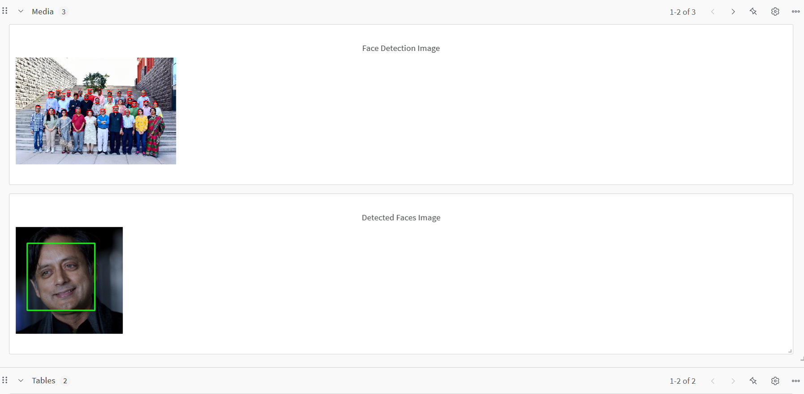

# Face Clustering with Hue & Saturation

This project performs face detection and clustering using OpenCV and K-Means based on hue and saturation features.  

## Weights & Biases Dashboard  
  

## Features  
- Face detection using OpenCV  
- Clustering based on color features  
- Automated logging to W&B  
- GitHub Actions workflow to auto-run notebook on code updates  
